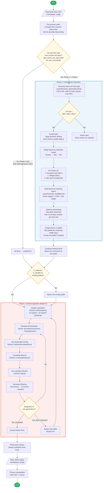

```mermaid
flowchart TD
    START([Start]) --> READ[/"Read order from CSV<br/><i>CSVReader::read()</i>"/]
    READ --> PREPROCESS["Pre-process order<br/>Compute item volumes, base areas<br/>Sort by quantity descending"]
    PREPROCESS --> DECISION{"Can any item type<br/>form at least one layer?<br/><i>(qty ≥ items_per_layer AND<br/>fill_rate ≥ threshold)</i>"}

    DECISION -- "Yes: Phase 1 + Phase 2" --> LAYER_GEN
    DECISION -- "No: Phase 2 only<br/>(fully heterogeneous order)" --> ALL_RESIDUAL["All items → residual list"]

    subgraph PHASE1 ["Phase 1: Constructive Heuristics"]
        direction TB
        LAYER_GEN["Generate layers per item type<br/><i>LayerGenerator::generateLayers()</i><br/>Full (L×W), Half (L/2×W), Quarter (L/2×W/2)"]
        LAYER_GEN --> FILL_CHECK{"Fill rate ≥<br/>95% / 90% / 85%?"}
        FILL_CHECK -- "Yes" --> ACCEPT_LAYER["Accept layer<br/>Apply dynamic shifting<br/>(push items to pallet edges)"]
        FILL_CHECK -- "No" --> REJECT_LAYER["Reject layer<br/>Items remain as residuals"]
        ACCEPT_LAYER --> MERGE["Merge layers by matching height<br/>Quarter → Half → Full"]
        MERGE --> SORT_LAYERS["Sort layers by:<br/>1. Occupied area (desc)<br/>2. Weight (desc)<br/>3. Item type homogeneity"]
        SORT_LAYERS --> BLOCK_BUILD["Build blocks by stacking layers<br/><i>LayerGenerator::buildBlocks()</i><br/>Check support + COM + max height"]
        BLOCK_BUILD --> INTERLOCK["Optimize interlocking<br/><i>Hausdorff::distance()</i><br/>Test 4 symmetry variants per layer pair"]
        INTERLOCK --> ASSIGN["Assign blocks to pallets<br/>Sort pallets by remaining height (asc)<br/>Create new pallet if needed"]
    end

    ASSIGN --> RESIDUAL["Compute residual items<br/>(items not consumed by any layer)"]
    ALL_RESIDUAL --> VOL_CHECK
    RESIDUAL --> VOL_CHECK

    VOL_CHECK{"V_residual ≤<br/>V_useable on<br/>existing pallets?"}
    VOL_CHECK -- "Yes" --> GA_START
    VOL_CHECK -- "No" --> NEW_PALLET["Spawn new empty pallet"]
    NEW_PALLET --> GA_START

    subgraph PHASE2 ["Phase 2: Genetic Algorithm (NSGA-II)"]
        direction TB
        GA_START["Initialize population<br/><i>NSGA2::initPopulation()</i><br/>10 seeded + 40 random individuals"]
        GA_START --> EVAL["Evaluate all individuals<br/><i>Packer::decode(chromosome)</i><br/>→ PackingSolution"]
        EVAL --> NDS["Non-dominated sorting<br/><i>NSGA2::fastNonDominatedSort()</i>"]
        NDS --> CROWD["Crowding distance<br/><i>NSGA2::crowdingDistance()</i>"]
        CROWD --> SELECT["Mu+Lambda selection<br/><i>NSGA2::select()</i>"]
        SELECT --> OFFSPRING["Generate offspring<br/>Tournament → Crossover → Mutation"]
        OFFSPRING --> STAGNATION{"Stagnation or<br/>max generations?"}
        STAGNATION -- "No" --> EVAL
        STAGNATION -- "Yes, all packed" --> PARETO["Extract Pareto front"]
        STAGNATION -- "Yes, items unpacked" --> FAIL_RESTART["Spawn new pallet<br/>Restart GA"]
        FAIL_RESTART --> GA_START
    end

    PARETO --> BEST["Select best solution<br/>(fewest containers from front)"]
    BEST --> JSON[/"Write JSON output<br/><i>JSONWriter::write()</i>"/]
    JSON --> VIZ["Three.js visualization<br/><i>index.html + main.js</i>"]
    VIZ --> FINISH([End])

    style PHASE1 fill:#EBF5FB,stroke:#2E86AB,stroke-width:2px
    style PHASE2 fill:#FDEDEC,stroke:#C73E1D,stroke-width:2px
    style DECISION fill:#FEF9E7,stroke:#F39C12,stroke-width:2px
    style VOL_CHECK fill:#FEF9E7,stroke:#F39C12,stroke-width:2px
    style STAGNATION fill:#FEF9E7,stroke:#F39C12,stroke-width:2px
    style FILL_CHECK fill:#FEF9E7,stroke:#F39C12,stroke-width:2px
    style START fill:#27AE60,stroke:#1E8449,color:#fff
    style FINISH fill:#27AE60,stroke:#1E8449,color:#fff

```