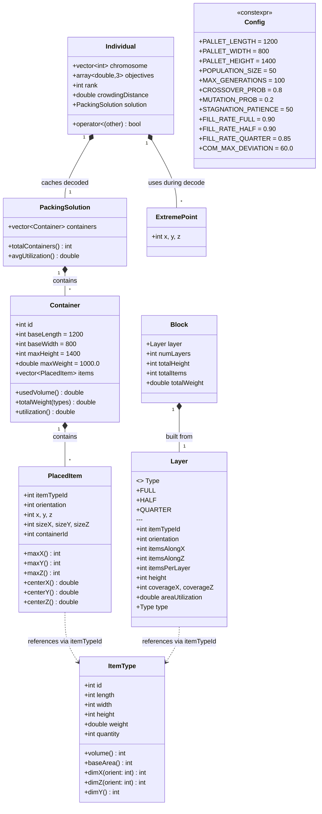

```mermaid
classDiagram
    direction TB

    class ItemType {
        +int id
        +int length
        +int width
        +int height
        +double weight
        +int quantity
        +volume() int
        +baseArea() int
        +dimX(orient: int) int
        +dimZ(orient: int) int
        +dimY() int
    }

    class PlacedItem {
        +int itemTypeId
        +int orientation
        +int x, y, z
        +int sizeX, sizeY, sizeZ
        +int containerId
        +maxX() int
        +maxY() int
        +maxZ() int
        +centerX() double
        +centerY() double
        +centerZ() double
    }

    class Container {
        +int id
        +int baseLength = 1200
        +int baseWidth = 800
        +int maxHeight = 1400
        +double maxWeight = 1000.0
        +vector~PlacedItem~ items
        +usedVolume() double
        +totalWeight(types) double
        +utilization() double
    }

    class PackingSolution {
        +vector~Container~ containers
        +totalContainers() int
        +avgUtilization() double
    }

    class ExtremePoint {
        +int x, y, z
    }

    class Layer {
        <<enumeration>> Type
        +FULL
        +HALF
        +QUARTER
        ---
        +int itemTypeId
        +int orientation
        +int itemsAlongX
        +int itemsAlongZ
        +int itemsPerLayer
        +int height
        +int coverageX, coverageZ
        +double areaUtilization
        +Type type
    }

    class Block {
        +Layer layer
        +int numLayers
        +int totalHeight
        +int totalItems
        +double totalWeight
    }

    class Individual {
        +vector~int~ chromosome
        +array~double,3~ objectives
        +int rank
        +double crowdingDistance
        +PackingSolution solution
        +operator<(other) bool
    }

    class Config {
        <<constexpr>>
        +PALLET_LENGTH = 1200
        +PALLET_WIDTH = 800
        +PALLET_HEIGHT = 1400
        +POPULATION_SIZE = 50
        +MAX_GENERATIONS = 100
        +CROSSOVER_PROB = 0.8
        +MUTATION_PROB = 0.2
        +STAGNATION_PATIENCE = 50
        +FILL_RATE_FULL = 0.90
        +FILL_RATE_HALF = 0.90
        +FILL_RATE_QUARTER = 0.85
        +COM_MAX_DEVIATION = 60.0
    }

    Container "1" *-- "*" PlacedItem : contains
    PackingSolution "1" *-- "*" Container : contains
    Block "1" *-- "1" Layer : built from
    Individual "1" *-- "1" PackingSolution : caches decoded
    Individual "1" *-- "*" ExtremePoint : uses during decode
    PlacedItem ..> ItemType : references via itemTypeId
    Layer ..> ItemType : references via itemTypeId
```