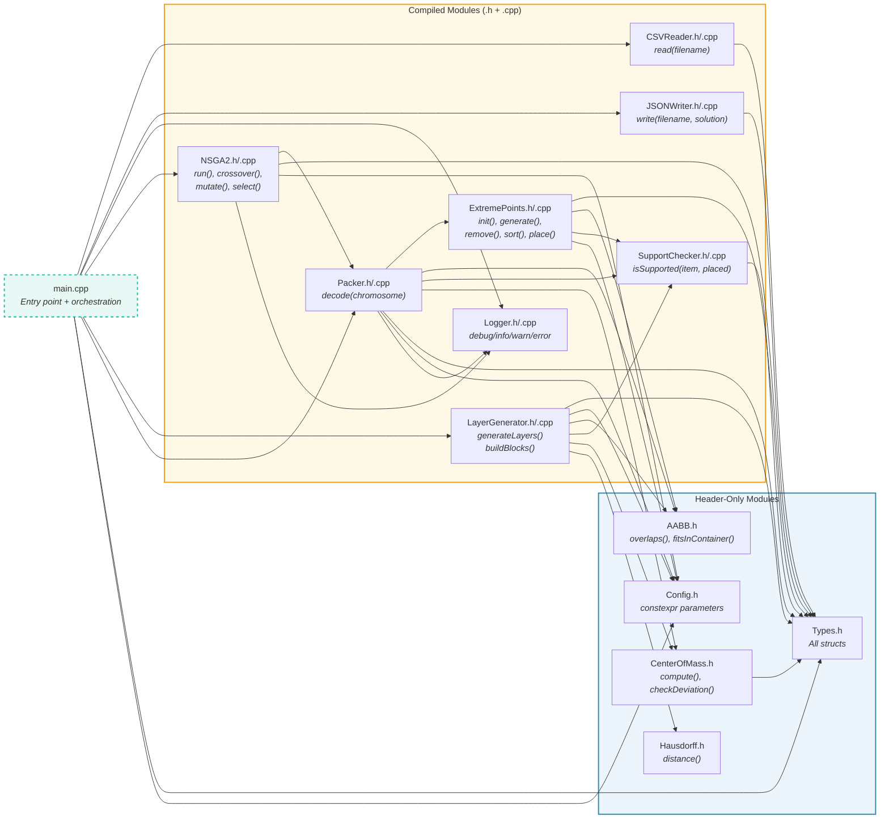

```mermaid
flowchart LR
    subgraph HEADERS ["Header-Only Modules"]
        direction TB
        CONFIG["Config.h<br/><i>constexpr parameters</i>"]
        TYPES["Types.h<br/><i>All structs</i>"]
        AABB["AABB.h<br/><i>overlaps(), fitsInContainer()</i>"]
        COM["CenterOfMass.h<br/><i>compute(), checkDeviation()</i>"]
        HAUS["Hausdorff.h<br/><i>distance()</i>"]
    end

    subgraph COMPILED ["Compiled Modules (.h + .cpp)"]
        direction TB
        CSV["CSVReader.h/.cpp<br/><i>read(filename)</i>"]
        JSON["JSONWriter.h/.cpp<br/><i>write(filename, solution)</i>"]
        LOG["Logger.h/.cpp<br/><i>debug/info/warn/error</i>"]
        SUPPORT["SupportChecker.h/.cpp<br/><i>isSupported(item, placed)</i>"]
        LAYERGEN["LayerGenerator.h/.cpp<br/><i>generateLayers()<br/>buildBlocks()</i>"]
        EP["ExtremePoints.h/.cpp<br/><i>init(), generate(),<br/>remove(), sort(), place()</i>"]
        PACKER["Packer.h/.cpp<br/><i>decode(chromosome)</i>"]
        NSGA["NSGA2.h/.cpp<br/><i>run(), crossover(),<br/>mutate(), select()</i>"]
    end

    MAIN["main.cpp<br/><i>Entry point + orchestration</i>"]

    %% main.cpp dependencies
    MAIN --> CSV
    MAIN --> JSON
    MAIN --> LOG
    MAIN --> NSGA
    MAIN --> LAYERGEN
    MAIN --> PACKER
    MAIN --> TYPES
    MAIN --> CONFIG

    %% NSGA2 dependencies
    NSGA --> PACKER
    NSGA --> TYPES
    NSGA --> CONFIG
    NSGA --> LOG

    %% Packer dependencies
    PACKER --> EP
    PACKER --> AABB
    PACKER --> SUPPORT
    PACKER --> COM
    PACKER --> TYPES
    PACKER --> CONFIG
    PACKER --> LOG

    %% LayerGenerator dependencies
    LAYERGEN --> TYPES
    LAYERGEN --> CONFIG
    LAYERGEN --> AABB
    LAYERGEN --> SUPPORT
    LAYERGEN --> COM
    LAYERGEN --> HAUS

    %% ExtremePoints dependencies
    EP --> TYPES
    EP --> AABB
    EP --> SUPPORT
    EP --> CONFIG

    %% SupportChecker dependencies
    SUPPORT --> TYPES

    %% I/O dependencies
    CSV --> TYPES
    JSON --> TYPES

    %% CenterOfMass dependencies
    COM --> TYPES

    style HEADERS fill:#EBF5FB,stroke:#2E86AB,stroke-width:2px
    style COMPILED fill:#FEF9E7,stroke:#F39C12,stroke-width:2px
    style MAIN fill:#E8F8F5,stroke:#1ABC9C,stroke-width:2px,stroke-dasharray: 5 5
```