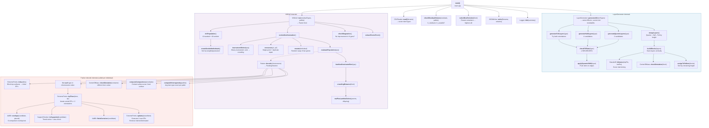

```mermaid
flowchart TD
    MAIN["<b>main()</b><br/><i>main.cpp</i>"]

    MAIN --> CSV_READ["CSVReader::<b>read</b>(filename)<br/>→ vector&lt;ItemType&gt;"]
    MAIN --> LAYER_GEN_ALL["LayerGenerator::<b>generateAll</b>(itemTypes)<br/>→ vector&lt;Block&gt;, vector&lt;int&gt; residualIds"]

    subgraph LAYER_INTERNALS ["LayerGenerator internals"]
        direction TB
        LAYER_GEN_ALL --> GEN_FULL["<b>generateFullLayers</b>(type)<br/>Try both orientations"]
        LAYER_GEN_ALL --> GEN_HALF["<b>generateHalfLayers</b>(type)<br/>4 candidates"]
        LAYER_GEN_ALL --> GEN_QUARTER["<b>generateQuarterLayers</b>(type)<br/>2 candidates"]
        GEN_FULL --> CHECK_FILL["<b>checkFillRate</b>(layer)<br/>≥ 90%/90%/85%"]
        GEN_HALF --> CHECK_FILL
        GEN_QUARTER --> CHECK_FILL
        CHECK_FILL --> SHIFT["<b>applyDynamicShift</b>(layer)<br/>Push items to edges"]
        LAYER_GEN_ALL --> MERGE_LAYERS["<b>mergeLayers</b>()<br/>Quarter→Half→Full by height"]
        MERGE_LAYERS --> BUILD_BLOCKS["<b>buildBlocks</b>(layers)<br/>Stack layers vertically"]
        BUILD_BLOCKS --> HAUS_CALL["Hausdorff::<b>distance</b>(topPts, botPts)<br/>Score interlocking"]
        BUILD_BLOCKS --> COM_BLOCK["CenterOfMass::<b>checkDeviation</b>(block)"]
        BUILD_BLOCKS --> ASSIGN_PALLETS["<b>assignToPallets</b>(blocks)<br/>Sort by remaining height"]
    end

    MAIN --> VOL_CHECK_FN["<b>checkResidualVolume</b>(residuals, pallets)<br/>V_residual ≤ V_useable?"]
    MAIN --> GA_RUN["NSGA2::<b>run</b>(residualTypes, pallets)<br/>→ Pareto front"]

    subgraph GA_INTERNALS ["NSGA2 internals"]
        direction TB
        GA_RUN --> INIT_POP["<b>initPopulation</b>()<br/>10 seeded + 40 random"]
        INIT_POP --> SEED["<b>createSeededIndividuals</b>()<br/>Sort by weight/qty/area/vol"]
        GA_RUN --> EVOLVE["<b>evolveOneGeneration</b>()"]
        EVOLVE --> TOURNAMENT["<b>tournamentSelect</b>(pop)<br/>Binary tournament: rank → crowding"]
        EVOLVE --> CROSSOVER["<b>crossover</b>(p1, p2)<br/>Single-point + duplicate repair"]
        EVOLVE --> MUTATE["<b>mutate</b>(individual)<br/>Random swap of two genes"]
        EVOLVE --> EVAL_ALL["<b>evaluatePopulation</b>(pop)"]
        EVAL_ALL -.-> DECODE["Packer::<b>decode</b>(chromosome)<br/>→ PackingSolution"]
        EVAL_ALL --> NDS["<b>fastNonDominatedSort</b>(pop)"]
        NDS --> CROWDING["<b>crowdingDistance</b>(front)"]
        CROWDING --> MU_LAMBDA["<b>muPlusLambdaSelect</b>(parents, offspring)"]
        GA_RUN --> STAG_CHECK["<b>checkStagnation</b>()<br/>No improvement in N gens?"]
        GA_RUN --> EXTRACT_FRONT["<b>extractParetoFront</b>()"]
    end

    subgraph DECODE_INTERNALS ["Packer::decode internals (called per individual)"]
        direction TB
        DECODE --> EP_INIT["ExtremePoints::<b>init</b>(pallets)<br/>Block top-surfaces → initial EPs"]
        DECODE --> PLACE_LOOP["<b>for each</b> type in chromosome order:"]
        PLACE_LOOP --> TRY_EP["ExtremePoints::<b>tryPlace</b>(item, ep)<br/>Iterate sorted EPs × 2 orientations"]
        TRY_EP --> AABB_CHECK["AABB::<b>overlaps</b>(candidate, placed)<br/>6-comparison overlap test"]
        TRY_EP --> SUPPORT_CHECK["SupportChecker::<b>isSupported</b>(candidate)<br/>Tiered vertex + area check"]
        TRY_EP --> BOUNDS_CHECK["AABB::<b>fitsInContainer</b>(candidate)"]
        TRY_EP --> EP_UPDATE["ExtremePoints::<b>update</b>(placedItem)<br/>Generate 3 new EPs<br/>Remove interior/dominated"]
        DECODE --> COM_FINAL["CenterOfMass::<b>checkDeviation</b>(container)<br/>±60mm from center"]
        DECODE --> COMPACT["<b>computeCompactness</b>(residuals)<br/>Contact surface area / total surface"]
        DECODE --> HETERO["<b>computeHeterogeneity</b>(pallets)<br/>Avg item type count per pallet"]
    end

    MAIN --> SELECT_BEST["<b>selectBestSolution</b>(front)<br/>Fewest containers → highest util"]
    MAIN --> JSON_WRITE["JSONWriter::<b>write</b>(filename, solution)"]
    MAIN --> LOG_RESULT["Logger::<b>info</b>(summary)"]

    style LAYER_INTERNALS fill:#EBF5FB,stroke:#2E86AB,stroke-width:1px
    style GA_INTERNALS fill:#F5EEF8,stroke:#5B5EA6,stroke-width:1px
    style DECODE_INTERNALS fill:#FDEDEC,stroke:#C73E1D,stroke-width:1px
```